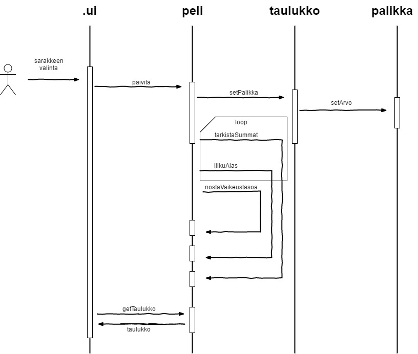
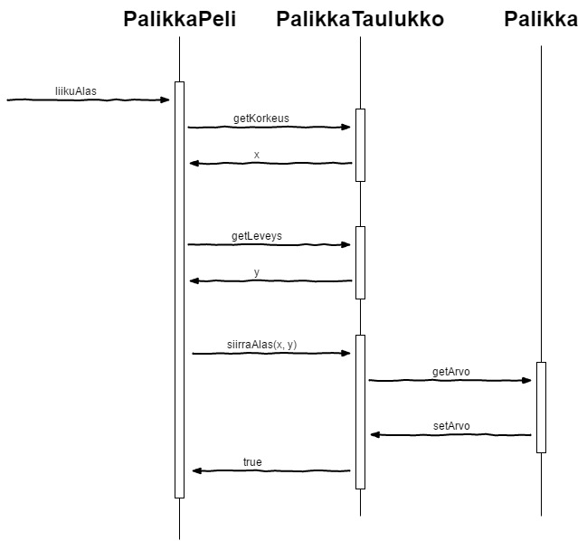

**Aihe:** Binarytetris. Toteutetaan peli, jossa palikat ovat pieni‰ bin‰‰rinumeroita, joita kasataan 
pinoihin tavoitteena saada p‰‰llek‰isiin tai vierekk‰isiin palikoihin tietty summa, jolloin palikat 
katoavat. Pelin tarkoituksena on oppia hahmottamaan ja laskemaan yhteen pieni‰ bin‰‰rilukuja.

#### Rakenne:
Peliss‰ on nelj‰ luokkaa: Palikka, PalikkaTaulukko, PalikkaPeli ja Kayttˆliittyma. Pelaajalle n‰kyy 
pelk‰st‰‰n k‰yttˆliittym‰, ja h‰n valitsee sit‰ kautta ensin pelin tyypin, sen j‰lkeen itse peliss‰ 
mit‰ saraketta p‰ivitet‰‰n. PalikkaPeli huolehtii p‰ivityksen yhteydess‰ tapahtuvista toiminnoista, 
ja k‰ytt‰‰ PalikkaTaulukkoa ja sit‰ kautta Palikka-luokkaa palikoiden sijaintien muokkaamiseen.

#### K‰yttˆohje:
- Valitse alkuvalikosta ala- ja yl‰rajat pelin kululle. Halutessasi voit valita pikapelin, jolloin joka kerta 
kun saat vierekk‰isist‰ tai p‰‰llekk‰isist‰ palikoista muodostettua pyydetyn summan, summa kasvaa yhdell‰. 
Tavallisessa peliss‰ yritet‰‰n saada viisi kertaa per‰kk‰in sama summa.
- Pelivalikon oikeassa reunassa n‰kyy seuraava palikka, ja alempana summa, jota tavoittelet. Valitse yl‰reunasta 
mihin sarakkeeseen haluat pudottaa palikan. Peli p‰‰ttyy kun saat valitsemasi ylimm‰n summan suoritettua, tai 
joku palikoista j‰‰ koskemaan yl‰reunaa.

#### Pelaajan toiminnot:
- aloitussumman valinta
- viimeisen summan valinta
- pikapeli-mahdollisuus
- pelin aloitus
- palikan pudotuspaikan valinta
- uusi peli

#### Pelin‰kym‰:
- sarakkeiden valinta
- pelialue
	* pudotetut palikat
- sivupalkki
	* seuraavana vuorossa oleva palikka
	* pisteet
	* tavoiteltava summa
#### Lopetusn‰kym‰:
- Voitit/h‰visit
- Mihin summaan j‰‰tiin
- Uusi peli

----

#### Luokkakaavio:

#### Sekvenssikaavio nro.1

#### Sekvenssikaavio nro.2

 