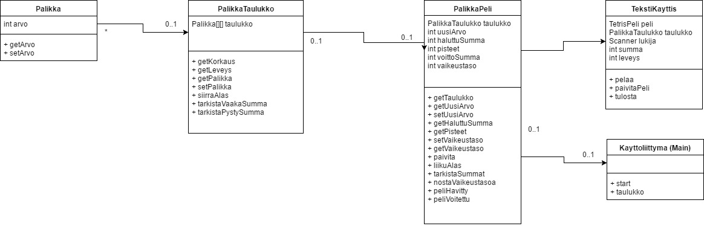

**Aihe:** Binarytetris. Toteutetaan peli, jossa palikat ovat pieni‰ bin‰‰rinumeroita, joita kasataan pinoihin tavoitteena saada p‰‰llek‰isiin tai vierekk‰isiin palikoihin tietty summa, jolloin palikat katoavat.
#### Pelaajan toiminnot:
- aloitussumman valinta
- viimeisen summan valinta
- pelin aloitus
- palikan pudotuspaikan valinta
#### Pelin‰kym‰:
- sarakkeiden valinta
- pelialue
	* pudotetut palikat
- seuraavana vuorossa oleva palikka
- pisteet
- tavoiteltava summa
#### Mahdollisia muita toimintoja:
- vaikeustason kasvaminen
- mahdollisuus valita mit‰ summaa tavoitellaan

----

 